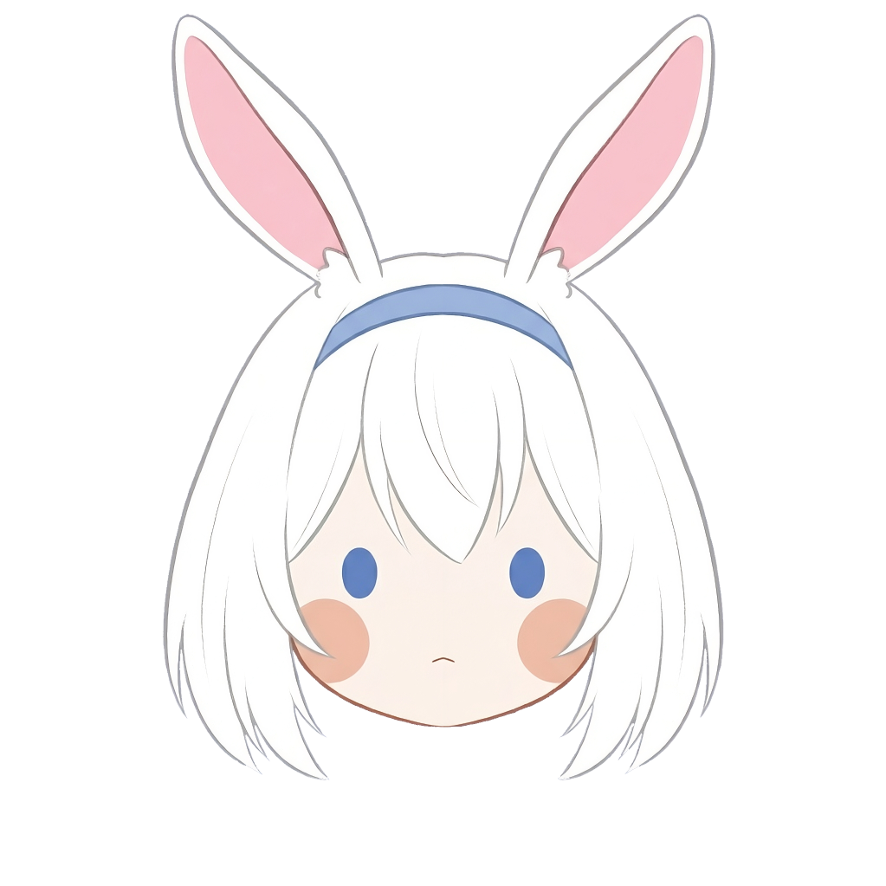

[![Contributors][contributors-shield]][contributors-url]
[![Forks][forks-shield]][forks-url]
[![Stars][stars-shield]][stars-url]
[![Issues][issues-shield]][issues-url]
[![License][license-shield]][license-url]

<br />
<div align="center">
  <a href="https://github.com/othneildrew/Best-README-Template">
    
  </a>

  <h3 align="center">Best-README-Template</h3>

  <p align="center">
    An awesome README template to jumpstart your projects!
    <br />
    <a href="https://github.com/othneildrew/Best-README-Template"><strong>Explore the docs »</strong></a>
    <br />
    <br />
    <a href="https://discord.com/oauth2/authorize?client_id=1398686204228014091&permissions=8&integration_type=0&scope=bot">View Demo (Bot Link)</a>
    &middot;
    <a href="https://github.com/InvalidDavid/Usagi-Bot/issues/new?template=--bug-report-%F0%9F%90%9E.md">Report Bug</a>
    &middot;
    <a href="https://github.com/InvalidDavid/Usagi-Bot/issues/new?template=feature-request-%F0%9F%9A%80.md">Request Feature</a>
  </p>
</div>

# Manga-Bot

A Py-cord bot for the Mabga Discord server.

### Some features works only on one server.
first time using rly README.md so gonna update that one in the feature better.

## Local Setup

Use Python 3.13 for this project. Python 3.14 is currently too new for the Bot's Py-cord stack and can break local startup.

```bash
python3.13 -m venv .venv
source .venv/bin/activate
pip install -r requirements.txt
python main.py
```

If you already created `.venv` with another Python version, remove it and recreate it with Python 3.13 before installing dependencies again.

## Architecture

The runtime entrypoint stays in `main.py`, while the implementation now lives in a modular internal package:

```text
├── cog/
│   ├── anilist          # Search for Anime / Manga from the Anilist list through the API search
│   ├── errorhandler     # Automatic handler for slash / normal commands as well on_global_error by unexpected errors goes into a seperate server which you can configurate it in the .env for the webhook
│   ├── games            # Rock-Paper-Scissors & TicTacToe game, both with random generated Moves
│   ├── mod              # Only moderation for Threads (Support stuff)
│   ├── owner            # cog commands and owner
│   └── user             # at the moment only a info bot stat command
├── main.py          
└── requirements.txt
```

> [!NOTE]
> - Forum and role settings are read safely from `.env` through the shared config loader.
> - Don`t forget to install the package from the requirements.txt.
> - As well the right Data in `.env`.


<!-- MARKDOWN LINKS & IMAGES -->
<!-- https://www.markdownguide.org/basic-syntax/#reference-style-links -->
[contributors-shield]: https://img.shields.io/github/contributors/othneildrew/Best-README-Template.svg?style=for-the-badge
[contributors-url]: https://github.com/InvalidDavid/Usagi-Bot/graphs/contributors
[forks-shield]: https://img.shields.io/github/forks/othneildrew/Best-README-Template.svg?style=for-the-badge
[forks-url]: https://github.com/InvalidDavid/Usagi-Bot/network/members
[stars-shield]: https://img.shields.io/github/stars/othneildrew/Best-README-Template.svg?style=for-the-badge
[stars-url]: https://github.com/InvalidDavid/Usagi-Bot/stargazers
[issues-shield]: https://img.shields.io/github/issues/othneildrew/Best-README-Template.svg?style=for-the-badge
[issues-url]: https://github.com/InvalidDavid/Usagi-Bot/issues
[license-shield]: https://img.shields.io/github/license/othneildrew/Best-README-Template.svg?style=for-the-badge
[license-url]: https://github.com/InvalidDavid/Usagi-Bot/blob/main/LICENSE
